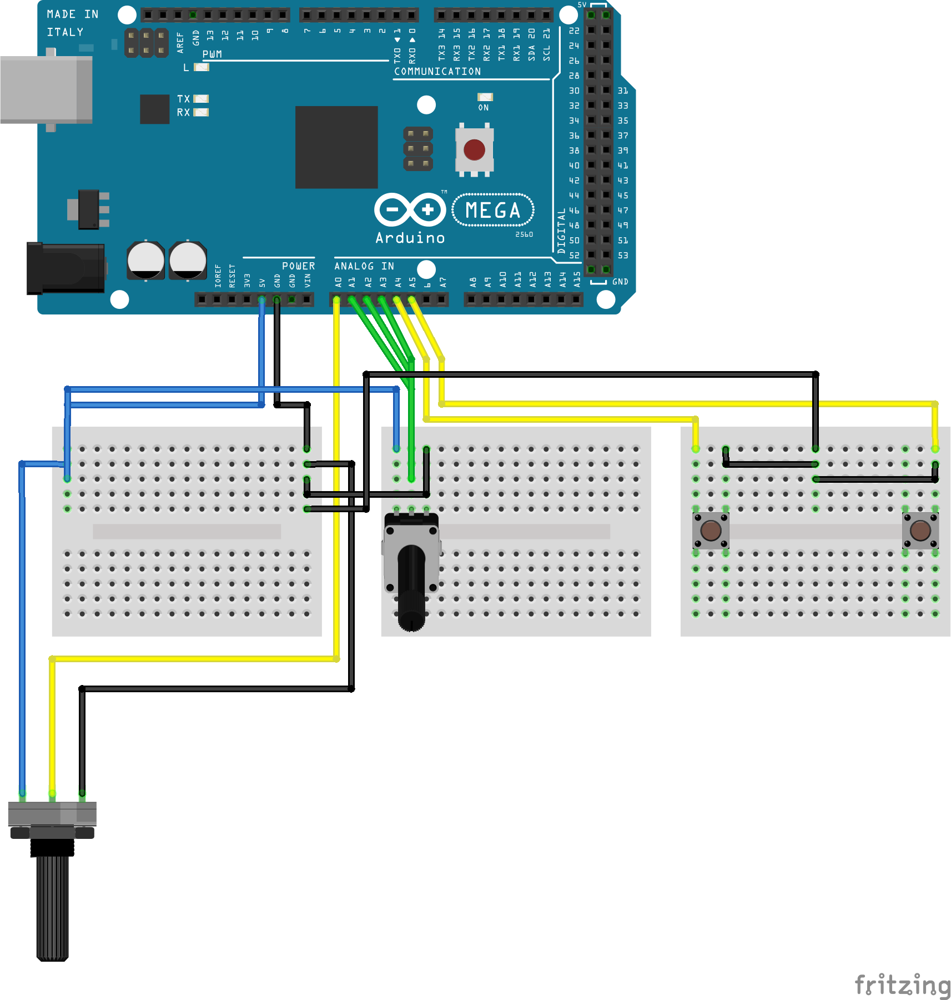

# 64BitAstro-Steering-Wheel (Version: Prototype 1) As of 25/9/2021
Prototype Steering Wheel Designed to be used with F1 Games from Codemasters. But any other games should work fine through key-mapping. (Powered by Unojoy)

## Use in Arduino
### Firmware Installation
[Put Arduino in DFU Mode](https://www.arduino.cc/en/Hacking/DFUProgramming8U2)\
Execute TurnIntoAJoyStick.bat

### Firmware Updating
[Put Arduino in DFU Mode](https://www.arduino.cc/en/Hacking/DFUProgramming8U2)\
Execute TurnIntoAnArduino.bat\
Update the Arduino Code\
Follow Firmware Installation

## Connections (Not Finalised)
A0 = Steering Wheel Direction X (Left Analog Stick)\
A1 = Brake (Left Trigger) Currently a Button but can be changed to potentiometer for Analog Data\
A2 = Throttle (Right Trigger) Currently a Button but can be changed to potentiometer for Analog Data

## Schematics (Not Finalised) Last Updated 24/9/2021

